# Boca Maldita — Fine Dining & Grill

Website oficial do restaurante **Boca Maldita**, em Vila de Prado, Vila Verde. Teatro culinário com mestria no fogo nobre, carnes maturadas seletas e alta hospitalidade no coração do Minho.

**Em produção:** https://bmaldita.vercel.app

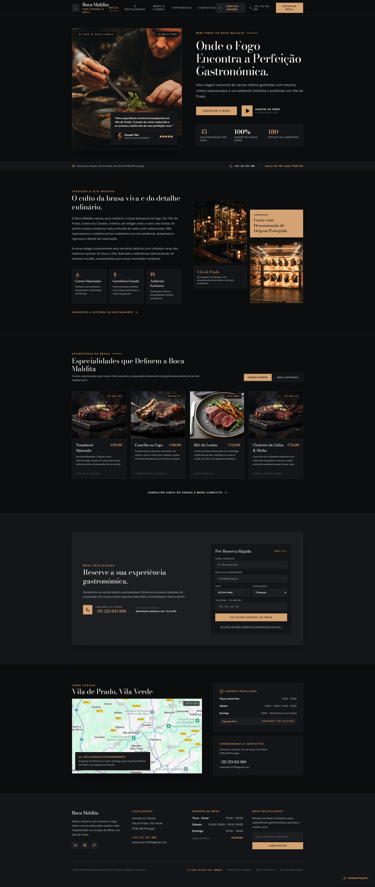

## Screenshots

> Capturados em **2026-09-19**. A interface evoluiu desde então — a referência da reserva
> passou a ser mostrada ao cliente nas duas variantes e os botões de imagem foram
> reformulados. Servem para dar o tom, não para documentar o estado actual.

### Site público

| | |
| --- | --- |
| 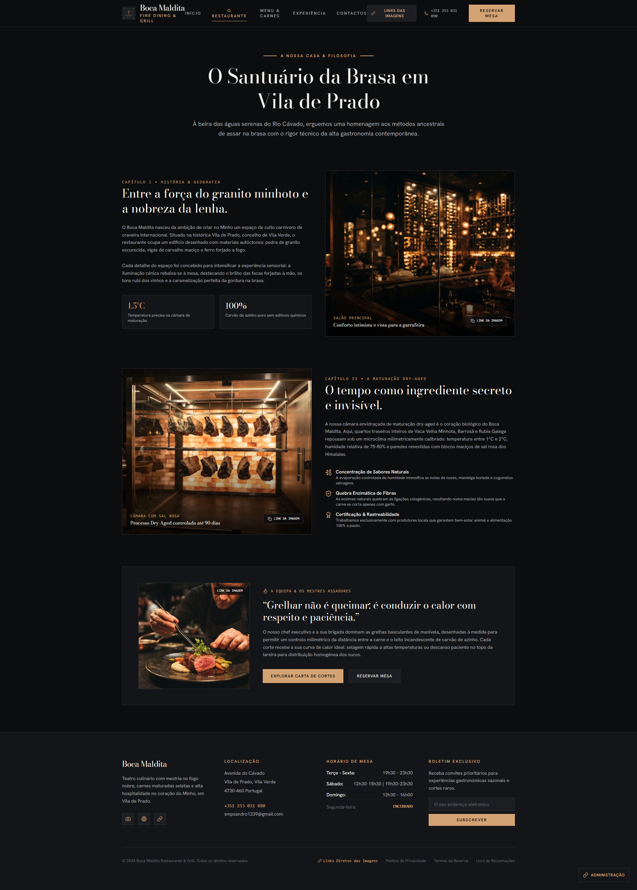 | 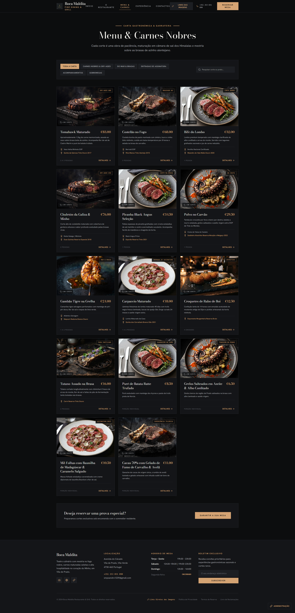 |
| 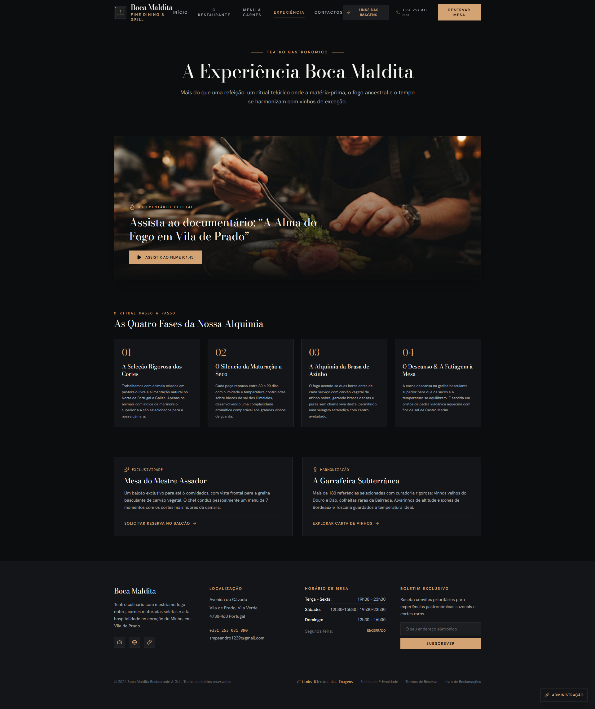 | 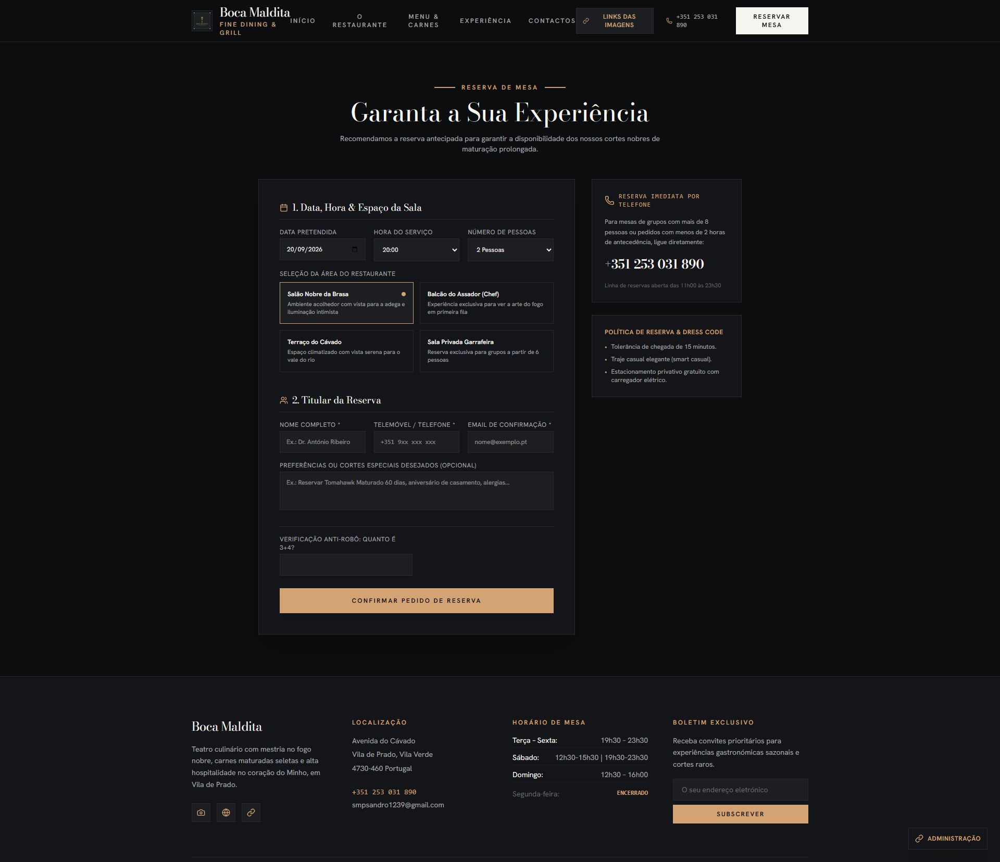 |
| 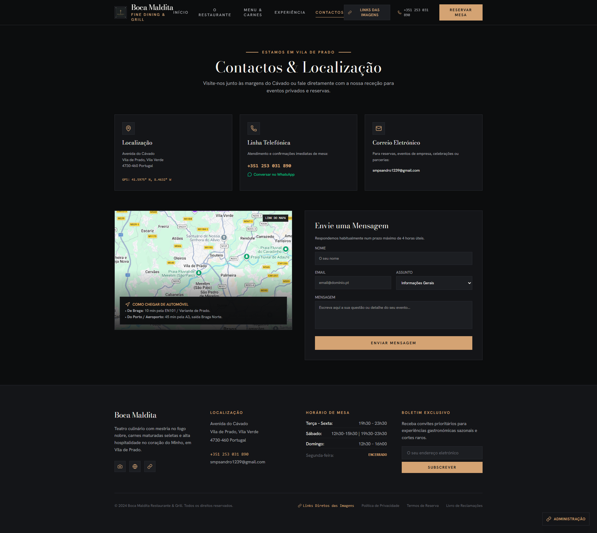 | |

### Painel de administração

| | |
| --- | --- |
| 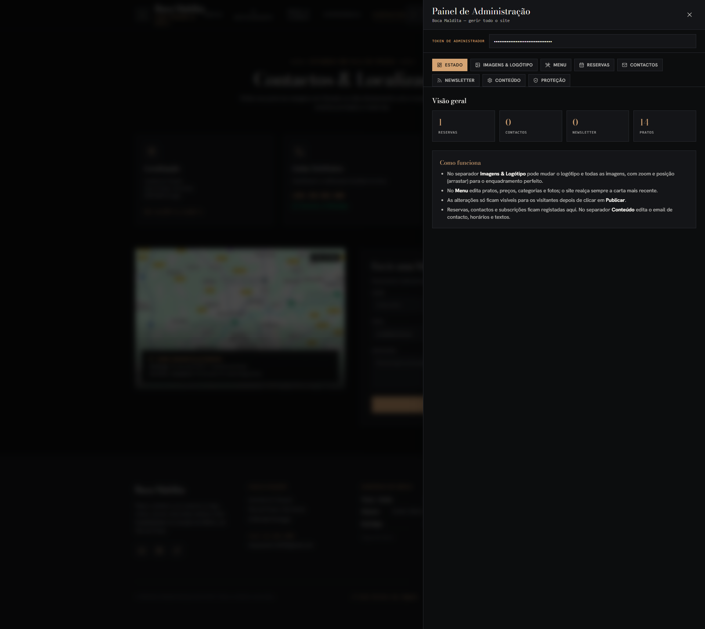 | 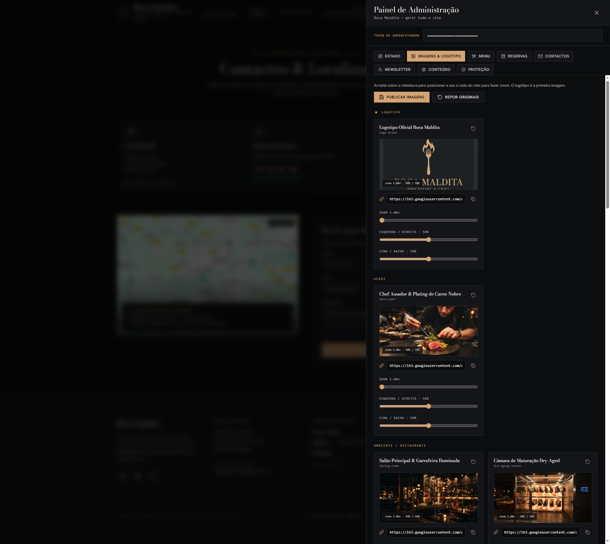 |
| 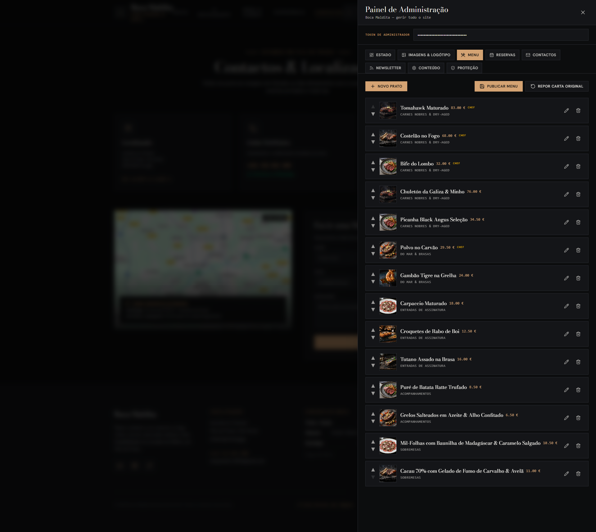 | 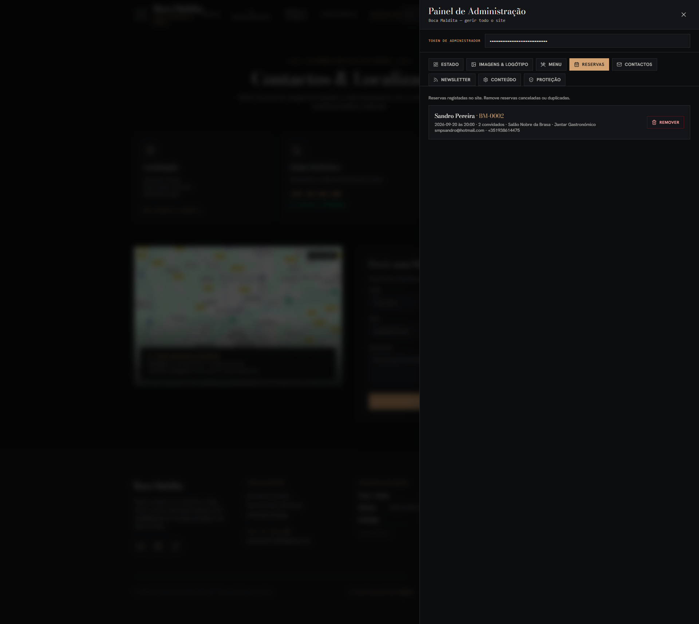 |
| 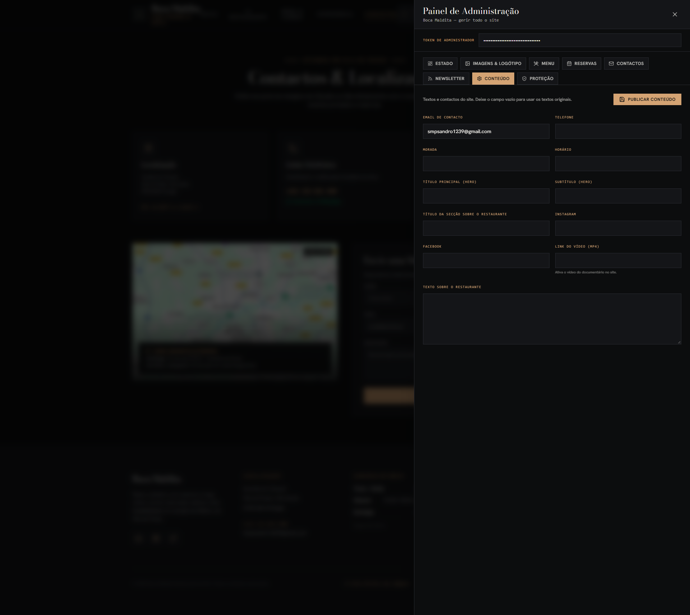 | 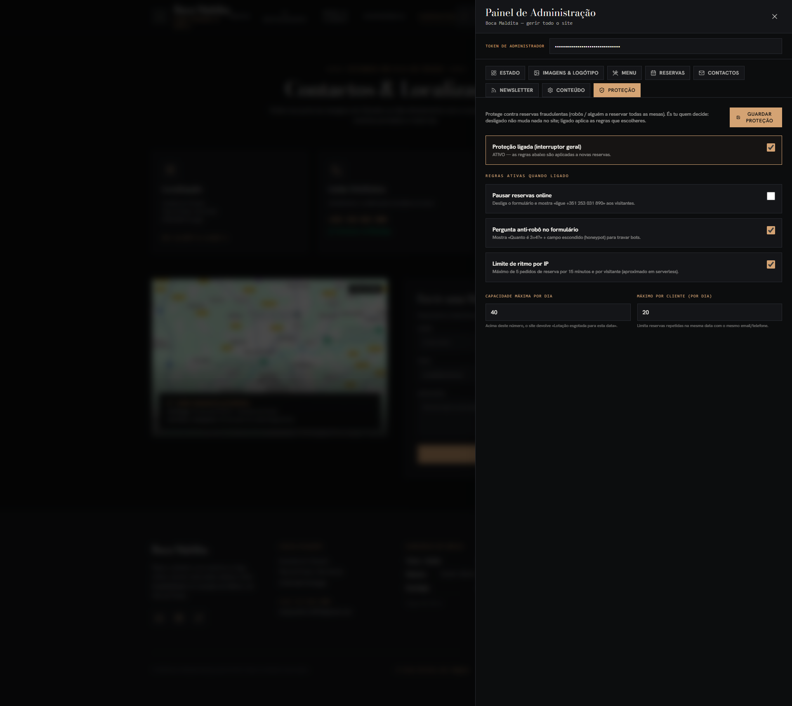 |

## Stack

- **Frontend:** React 19, TypeScript, Vite 6, Tailwind CSS 4, lucide-react
- **Backend:** Node.js + Express 4, validação com Zod, confirmações por email (nodemailer)
- **Base de dados:** SQLite local (`node:sqlite`) em dev; **Turso** (SQLite alojado) em produção/Vercel
- **Deploy:** Vercel (frontend estático + função serverless `/api`)

## Como correr localmente

Pré-requisitos: Node.js >= 20.

1. Instalar dependências:

   ```bash
   npm install
   ```

2. Configurar variáveis de ambiente:

   ```bash
   cp .env.example .env
   ```

   Os valores por omissão funcionam para dev; preencha `SMTP_*` para ativar os emails de confirmação e `ADMIN_TOKEN` para o painel de administração.

3. Arrancar frontend + backend em desenvolvimento:

   ```bash
   npm run dev
   ```

   - Frontend (Vite): http://localhost:3000
   - API (Express): http://localhost:3001
   - Em dev, o Vite faz proxy de `/api` para o backend em `:3001`.

## Scripts

| Comando            | Descrição                                          |
| ------------------ | -------------------------------------------------- |
| `npm run dev`      | Arranca API e frontend em paralelo (Vite + tsx watch) |
| `npm run dev:web`  | Apenas frontend (Vite)                             |
| `npm run dev:api`  | Apenas API (tsx watch)                             |
| `npm run build`    | Gera `api/index.js` (API serverless num ficheiro único) e compila o frontend para `dist/` |
| `npm run preview`  | Serve o `dist/` localmente (Vite)                    |
| `npm start`        | Serve a API (e o `dist/` se existir) em produção     |
| `npm run lint`     | Verificação de tipos (tsc --noEmit)               |
| `npm run typecheck`| Alias de `lint`                                    |
| `npm run test`     | Testes unitários e de render (Vitest)              |
| `npm run test:watch`| Testes em modo watch                             |
| `npm run smoke`    | Smoke test da API em base efémera                  |
| `npm run verify`   | **Gate de pré-deploy**: typecheck + test + smoke + build |
| `npm run clean`    | Remove artefactos de build (`dist/`, `.vercel/`)    |

> `npm run verify` é obrigatório antes de qualquer deploy e antes de publicar a
> carta em produção. Como o `tsc` só vale se os tipos existirem, `@types/react` e
> `@types/react-dom` são `devDependencies` permanentes: sem eles os hooks vêm de
> JS inferido, `useState`/`useMemo` devolvem `any` e o cliente nunca é
> verificado a sério.

## Estrutura

```
api/index.js   # Função serverless (Vercel) — gerada por scripts/build-api.mjs (não editar)
server/lib/     # Backend Express + armazenamento (partilhado com o servidor local)
  app.ts       # Fábrica da aplicação (rotas, admin, email) — usada em local e Vercel
  storage.ts   # Camada de dados: Turso, SQLite local ou memória (por variáveis de ambiente)
  email.ts     # Envio de emails (SMTP, opcional) — ver docs/email.md
  validation.ts# Schemas Zod
server/index.ts# Arranque do servidor Express local
src/           # Frontend React (screens/, components/, context/, data/, lib/)
  lib/reservation.ts # Único módulo de reservas — valida, monta e submete (ver "Reservas")
shared/        # Contratos partilhados entre backend e frontend (contracts.ts)
scripts/       # build-api.mjs, api-entry.ts, prerender.mjs, smoke-test.mjs,
               # smoke-admin.mjs, backup-db.mjs, clean.mjs, migrations/
vercel.json    # Configuração de deploy Vercel
docs/          # decisions.md (porquê das decisões), email.md (operacional)
```

## Credenciais de produção

Veja [credenciais-config.md](credenciais-config.md) para criar `SMTP_PASS` (palavra-passe de app do Gmail) e `TURSO_URL`/`TURSO_AUTH_TOKEN` (base de dados persistente) e colocá-los na Vercel.

## Reservas

O site público tem duas variantes e **ambas passam pelo mesmo módulo**,
`src/lib/reservation.ts`. Não existem duas lógicas de reserva.

| | Pré-Reserva Rápida | Reserva Completa |
| --- | --- | --- |
| Ecrã | `HomeScreen` | `ReservationScreen` |
| Campos do cliente | nome, email, telefone, data, convidados | + hora, área, ocasião, notas |
| Campos que o cliente não vê | vêm de `QUICK_DEFAULTS` (20:00, Salão Nobre da Brasa, "Pré-Reserva Rápida") | preenchidos pelo utilizador |

O módulo expõe três coisas:

- **`validateReservation`** — validação única para as duas. `extras === null` identifica a
  rápida. Inclui a pausa (`paused`), as datas fechadas (`findBlockedPeriod`) e a
  verificação anti-robô.
- **`buildReservationPayload`** — monta o payload; na rápida substitui os extras pelos
  `QUICK_DEFAULTS`, pelo que o que chega ao servidor é igual nas duas.
- **`submitReservation`** — ponto único de submissão: valida, envia e devolve a
  referência. Nenhum ecrã monta um payload por conta própria.

Depois de sucesso, **ambas as variantes mostram a referência `BM-XXXX` ao cliente.**

O resultado é um `SubmitOutcome` plano (`{ reference, error }`) e não uma união
discriminada — de propósito, por causa do `tsconfig` sem `strict`. Ver
[docs/decisions.md](docs/decisions.md).

## API

> **Autenticação de administração (D-3):** os endpoints `/api/admin/*` (e `PUT /api/site`) usam
> **cookie `bmtauth` (HttpOnly) + cookie `bmcsrf`**, criados no `POST /api/admin/login`, com TTL de
> 14 dias. As mutações exigem ainda o header `X-Csrf-Token` (igual ao cookie `bmcsrf`). O header
> `X-Admin-Token` continua aceite apenas como **fallback server-to-server** (Scripts, integrações) —
> não é usado pelo painel.

- `GET /api/health` — estado do servidor
- `GET /api/site` — definições públicas do site (`contactEmail`)
- `PUT /api/site` — atualizar email de contacto em todo o site (admin: cookie+CSRF, ou `X-Admin-Token`)
- `POST /api/reservations` — registar pedido de reserva (sujeito à proteção anti-fraude e às datas fechadas; envia email de confirmação se SMTP configurado)
- `GET /api/reservations-config` — configuração pública das reservas (pausa, pergunta anti-robô, **datas fechadas**)
- `POST /api/contacts` — registar mensagem de contacto
- `POST /api/newsletter` — subscrever boletim exclusivo (envia email de boas-vindas se SMTP configurado)
- `POST /api/reviews` — registar avaliação (fica pendente até aprovação do admin)
- `GET /api/reviews` — avaliações aprovadas (público)
- `GET /api/menus` — menu publicado (ou `null` se ainda não houver alterações)
- `GET /api/diarias` — **Menu Executivo** de uma data (parâmetro `date`, por omissão hoje): resolve horários, refeições e pratos para o dia
- `GET /api/site-content` — conteúdo público (email, contactos, textos, vídeo)
- `POST /api/admin/login` — iniciar sessão com `{ "token": "<ADMIN_TOKEN>" }`; devolve os cookies `bmtauth` + `bmcsrf`
- `GET /api/admin/session` — verificar a sessão atual (cookie ou `X-Admin-Token`)
- `POST /api/admin/logout` — terminar a sessão
- `GET /api/admin/verify-token` — validar sessão/token (legado; o ecrã de `/admin` usa `POST /api/admin/login`)
- `PUT /api/admin/security/token` — alterar o token do painel (política forte; o novo token passa a ser o efetivo, guardado na base; admin: cookie+CSRF, ou `X-Admin-Token`)
- `GET /api/admin/reviews`, `PUT /api/admin/reviews/:id`, `DELETE /api/admin/reviews/:id` — aprovar/rejeitar/remover avaliações (admin)
- `GET /api/admin/closed-days`, `POST /api/admin/closed-days`, `DELETE /api/admin/closed-days/:id` — gerir **datas fechadas** (dia único, intervalo com repetição semanal ou anual; admin)
- `GET /api/admin/assets`, `PUT /api/admin/assets`, `DELETE /api/admin/assets` — ler/publicar/repor imagens e logótipo (admin)
- `GET /api/admin/menus`, `PUT /api/admin/menus`, `DELETE /api/admin/menus` — ler/publicar/repor a carta (admin)
- `GET /api/admin/diarias`, `POST /api/admin/diarias`, `PUT /api/admin/diarias/:id`, `DELETE /api/admin/diarias/:id` — gestão do **Menu Executivo**: horários, refeições e repetição (admin)
- `PUT /api/admin/site-content` — publicar conteúdo/contactos (admin)
- `GET /api/admin/reservations`, `POST /api/admin/reservations`, `PUT /api/admin/reservations/:id`, `DELETE /api/admin/reservations/:id` — gestão completa de reservas (criar, duplicar, editar, remover; admin)
- `GET /api/admin/reservation-protection`, `PUT /api/admin/reservation-protection` — consultar/configurar a proteção anti-fraude das reservas (admin)
- `GET /api/admin/contacts`, `DELETE /api/admin/contacts/:id` — mensagens de contacto (admin)
- `GET /api/admin/newsletter`, `DELETE /api/admin/newsletter/:id` — subscrições do boletim (admin)

## Painel de administração

Acede-se em **https://bmaldita.vercel.app/admin** (em dev: `http://localhost:3000/admin` —
o Vite serve o SPA e faz proxy de `/api`). O site público **não mostra qualquer botão de
acesso** — ao abrir `/admin` é pedido o `ADMIN_TOKEN` num ecrã de login. Ao entrar, a
sessão fica guardada em cookies **`bmtauth` (HttpOnly) + `bmcsrf`** durante 14 dias; o
token em si não é guardado no navegador.

> `http://localhost:3001/admin` também funciona **se `dist/` existir** — o Express serve
> o SPA só nesse caso (`server/lib/app.ts` testa a pasta). Em dev limpo, usa `:3000`.

**Como a autenticação funciona (importante para scripts):**

- **Principal:** cookie `bmtauth` + cabeçalho `X-Csrf-Token` com o valor do cookie `bmcsrf`. É o caminho do browser e o que deve ser usado por qualquer automação com sessão.
- **Fallback:** cabeçalho `X-Admin-Token` com o valor do `ADMIN_TOKEN`. Só para integração/serviço a servidor; em qualquer caso o token é comparado com o do servidor e nunca deve ser registado em logs, commits ou capturas.

Separa-se em:

- **Estado** — contadores de reservas, contactos, newsletter e pratos, com explicação do fluxo.
- **Imagens & Logótipo** — altera o **logótipo** e todas as imagens do site (fundo, salão, pratos, mapa…).
  - Arraste sobre a miniatura para **posicionar** (esquerda/direita/cima/baixo; arrasto por rato **ou toque**) e use a **roda do rato** (ou os cursores) para fazer **zoom**;
  - O enquadramento aplica-se automaticamente em todo o site (objetos `cover` com `object-position` + `scale`);
  - "Publicar imagens" guarda no servidor para todos os visitantes; "Repor originais" volta aos placeholders.
- **Menu** — gestão completa da carta: adicionar, editar, duplicar posição, ocultar ou eliminar pratos; preço, categoria (inclui a **Carta de Vinhos**), foto, descrição, origem, sugestão de vinho e "especial do chef". Publicar atualiza o site; repor restaura a carta de origem.
- **Reservas** — duas vistas: **calendário** (grelha mensal com contagem de reservas por dia e lista detalhada do dia selecionado) ou **lista** agrupada por data (futuras primeiro, passadas ao fundo e esbatidas). Permite **criar**, **duplicar** e **editar** reservas, além de remover — "Reservar aqui" cria logo na data escolhida. O separador **Estado** tem atalhos "Reservas hoje" e "Novas 24h", que abrem o calendário nesse dia.
- **Datas Fechadas** — impede reservas em períodos específicos (fecho do restaurante): dia único, ou intervalo com **repetição semanal** (ex.: fins de semana) ou **anual** (ex.: Natal). O formulário público avisa e bloqueia a data escolhida; pedidos diretos aí recebem erro 423. O admin pode sempre registar reservas manualmente.
- **Avaliações** — avaliações dos clientes chegam pendentes; o admin **aprova** para aparecerem no site (ou rejeita/apaga). Incluem estrelas, nome, data e texto.
- **Contactos / Newsletter** — listas de todas as mensagens e subscrições recebidas, com remoção. Subscrever a newsletter envia um email de boas-vindas.
- **Proteção** — liga/desliga a proteção anti-fraude das reservas (pausa do formulário, pergunta anti-robô, limite de pedidos por IP e capacidade máxima por dia e por cliente). A pergunta anti-robô vem **ligada por predefinição** — é uma conta aritmética aleatória (ex.: "Quanto é 23 menos 8?") gerada no navegador, que o servidor valida sem armazenar nada (o cliente envia a pergunta e a resposta; o servidor recalcula pela expressão e aceita só a resposta certa). Inclui também um campo oculto (honeypot) que bots preenchem.
- **Segurança** — alterar o **token do painel** com política forte (mín. 16 caracteres, maiúscula, minúscula, número e símbolo) e gerador aleatório; o novo token passa a valer imediatamente em todo o site.
- **Conteúdo** — email de contacto (aplicado em todo o site), telefone, morada, horário, textos do hero, textos sobre o restaurante, redes sociais e link do vídeo (`.mp4`) do documentário.

As alterações só são visíveis para os visitantes depois de clicar em **Publicar**, o que exige o `ADMIN_TOKEN`. Sem `ADMIN_TOKEN` no servidor, o painel mostra o estado "Admin desativado".

> Para disponibilizar um vídeo oficial do "documentário" também pode colar o link `.mp4` no separador **Conteúdo** do painel (campo “Link do vídeo”).

## Deploy na Vercel

**O deploy é o push para `main`.** Push para `main` faz deploy automático em produção;
pushes para outros ramos fazem previews.

```bash
npm run verify            # gate obrigatório — tem de estar verde, ANTES do push
git push origin main      # isto é o deploy
```

**Regra: um push = um deploy.** Não acumular lotes nem repetir pushes "para tentar outra
vez" — cada um cria um deployment novo e torna ambíguo o que está em produção.

Para confirmar que o que está em produção corresponde ao repositório:

```bash
# o id do deployment sai de: npx vercel@59.26.0 inspect <url>
MSYS_NO_PATHCONV=1 npx vercel@59.26.0 api "/v13/deployments/<id>"   # lê meta.githubCommitSha
git rev-parse HEAD                                                   # tem de ser igual
```

`vercel inspect --json` **não** devolve `githubCommitSha` — é a API crua que o lê.
`MSYS_NO_PATHCONV=1` é obrigatório em Git Bash.

As variáveis de ambiente vivem no painel da Vercel (o `.env` do repositório não é lido em
produção): como as criar, em [credenciais-config.md](credenciais-config.md).

**Procedimento completo, armadilhas e checklist pós-deploy:**
[GUIA-DEPLOY.md](GUIA-DEPLOY.md) §1-§5.

## Email de confirmação

Sem `SMTP_HOST` não é enviado qualquer email — as reservas continuam a ser gravadas. Com
SMTP configurado, cada reserva gera um email HTML com a referência `BM-XXXX`, data, hora e
detalhes, e cada subscrição da newsletter gera um email de boas-vindas.

**O envio é feito em background.** A rota responde `201` de imediato e o email continua
vivo graças a `waitUntil` (`@vercel/functions`); o log de sucesso aparece **depois** da
resposta. Detalhes, mensagens de log e troubleshooting em [docs/email.md](docs/email.md).

O rodapé do site inclui **Política de Privacidade**, **Termos de Reserva** e **Livro de
Reclamações** — cada um abre a respetiva página legal com o conteúdo em português.

## Estado e pendências

| Grupo | Item |
| --- | --- |
| **Feito e verificado** | Código em produção; o `githubCommitSha` de cada deploy confirmado igual ao `HEAD` |
| **Depende de ti** | Token real do Google Search Console em `index.html` — hoje é um placeholder que o Google ignora |
| **Externos** | Reclamar e completar o Google Business Profile · migrar o DNS de `bocamaldita.pt` · confirmar a `SMTP_PASS` no dashboard da Vercel |
| **Adiado por decisão de negócio** | CTA WhatsApp no lugar do formulário de pausa (*desenhado, não implementado*) · migração para Cloudflare Pages (*analisado, não decidido*) |

Contexto de cada um: SEO e domínio em [GUIA-DEPLOY.md](GUIA-DEPLOY.md) §6-§7; a
`SMTP_PASS` em [docs/email.md](docs/email.md); as decisões em
[docs/decisions.md](docs/decisions.md).

## Autor

Sandro Pereira Dev